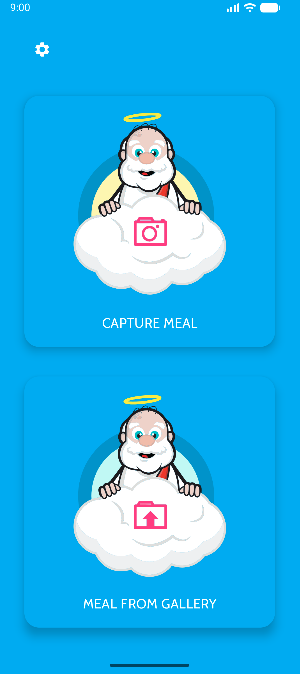
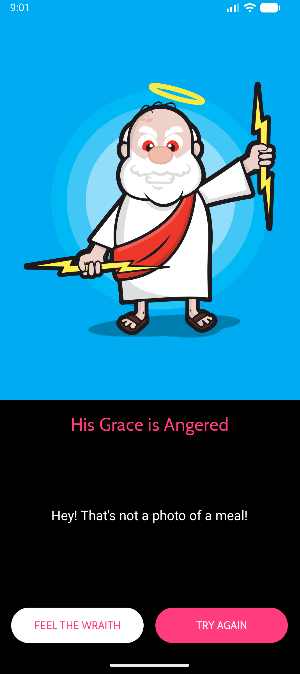
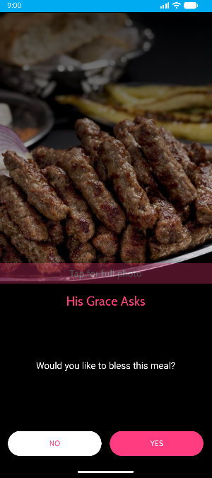

# Grace


# About

Kotlin Multiplatform rewrite of the [Grace](../Grace) Android app (a joke app that
blesses your meal). Android + iOS share a single **Compose Multiplatform** UI and all
business logic.

The full migration plan — current-state analysis, architecture decisions, parity
contract, and the phase-by-phase build order — lives in **[PLAN.md](PLAN.md)**.
The parity results (what was verified, what was not, and every accepted
deviation) live in **[docs/parity/REPORT.md](docs/parity/REPORT.md)**.


The current version of the app is part of the talk [for Droidcon Lisbon 26](https://x.com/droidconLisbon/status/2089261109689643248)


# Demo

   


## Status

| Phase | Description | State |
|---|---|---|
| 0 | Environment & prerequisites | ✅ [`docs/env-check.md`](docs/env-check.md) |
| 1 | Project creation (scaffold + hello world) | ✅ |
| 2 | Resources & theme migration | ✅ |
| 3 | Core shared infrastructure | ✅ |
| 4 | Domain & data (pure Kotlin + tests) | ✅ |
| 5 | Platform services | ✅ |
| 6 | Feature: Splash | ✅ |
| 7 | Feature: GetMeal + Disclaimer/TnC | ✅ |
| 8 | Features: Loading, Photo result, Photo details | ✅ |
| 9 | Journey integration & system behaviours | ✅ |
| 10 | Parity QA | ✅ [`docs/parity/REPORT.md`](docs/parity/REPORT.md) (one iOS item open) |
| 11 | Release preparation | ✅ |

Test suite: **55 tests on Android JVM, 63 on the iOS simulator**, 0 failures.

## Architecture

```
composeApp/src/commonMain/kotlin/com/grace/app/
├── App.kt                    # Koin graph + theme + AppNavHost
├── core/                     # GraceConstants, Log (expect/actual), isDebugBuild
├── domain/
│   ├── model/                # MealContent, FoodClassificationResult
│   ├── food/                 # FoodLabelMatcher, IsPhotoOfMealUseCase
│   └── photo/                # JpegExifReader, ImageTransforms, BlessGeometry,
│                             # CropGeometry, GraceFileNames, BlessPhotoUseCase
├── data/SettingsStore.kt     # multiplatform-settings (disclaimer_tnc_key)
├── platform/                 # interfaces: PhotoPicker, FoodClassifier,
│                             # ShareService, GraceFileStore, ImageProcessor,
│                             # ConnectivityObserver, SystemUi;
│                             # expect: PlatformWebView, platformScreenInsets
├── di/Modules.kt             # appModule + expect platformModule
└── ui/
    ├── navigation/           # Screen, Navigator, ScreenScope, AppNavHost
    ├── theme/                # GraceColors, GraceDimens, Type, GraceTheme
    ├── components/           # TypingIndicator, AutoSizeText, RoundedRippleButton,
    │                         # TapFullStrip, GraceSnackbarHost/Controller
    ├── splash/ getmeal/ policy/ loading/ photo/ photodetails/
```

- **UDF (State/Action/Effect) with ViewModels** replaces the original
  MVP + `Loader` + EventBus stack (ADR-2).
- **Koin** replaces Dagger (ADR-3).
- **A ~60-line `Navigator`** reproduces fragment `replace()` plus the single
  translucent activity on top (ADR-5).
- **Business values are named constants** (`GraceConstants`) with a unit test
  each — the parity contract from PLAN §3.1.

### Platform split

| Concern | Android | iOS |
|---|---|---|
| Classifier | ML Kit `image-labeling:17.0.9` @ 0.70 | Vision `VNClassifyImageRequest` @ 0.70 ⚠️ see report |
| Image pipeline | `BitmapFactory` + `Canvas` | `UIImage` + `CoreGraphics` |
| Picker | `ACTION_IMAGE_CAPTURE` / `ACTION_PICK` + FileProvider | `UIImagePickerController` / `PHPickerViewController` |
| WebView | `android.webkit.WebView` | `WKWebView` |
| Share | `ACTION_SEND` chooser | `UIActivityViewController` |
| Storage | `getExternalFilesDir(Pictures)/GraceApp` | `Documents/GraceApp` |
| Connectivity | `ConnectivityManager` | `NWPathMonitor` |

The shared half — EXIF parsing, orientation mapping, watermark geometry, crop
geometry, file naming and the food-label decision — is pure Kotlin in
`domain/`, and is what the unit tests pin down.

## Project layout

```
GraceKMP/
├── composeApp/
│   └── src/
│       ├── commonMain/         # shared Compose UI + business logic
│       │   ├── kotlin/com/grace/app/
│       │   └── composeResources/   # drawables, fonts, strings, files
│       ├── androidMain/        # actuals, manifest, res
│       ├── iosMain/            # actuals
│       ├── commonTest/         # shared unit tests
│       └── iosTest/            # tests that run the real UIKit pipeline
├── iosApp/                     # Xcode host project (SwiftUI)
├── docs/
│   ├── env-check.md
│   └── parity/                 # REPORT.md + screenshots
├── gradle/libs.versions.toml
└── PLAN.md
```

## Toolchain

| Component | Version |
|---|---|
| Kotlin | 2.4.10 |
| Compose Multiplatform | 1.12.0 (Material3 1.12.0-alpha03) |
| Android Gradle Plugin | 9.3.2 |
| Gradle | 9.5.0 |
| JDK | 17 |
| Android SDK | compile 37, min 24, target 34 |
| iOS deployment target | 15.0 |
| Koin (DI) | 4.2.2 |
| Coil (images) | 3.6.2 |
| ML Kit image-labeling | 17.0.9 |
| kotlinx-coroutines | 1.11.0 |
| kotlinx-datetime | 0.7.1 |
| multiplatform-settings | 1.3.0 |

### SDK-level deviations

PLAN.md assumed the original SDK levels (min 21 / compile 34). Two cannot be
kept with the chosen stack; both are library-forced:

- **compileSdk 34 → 37.** Compose 1.12.0 requires consumers to compile against
  API 37. `targetSdk` stays **34** for behavioural parity.
- **minSdk 21 → 24.** `koin-compose-viewmodel:4.2.2` declares minSdk 23; 24 was
  chosen to avoid a second bump. This is the only user-visible compatibility
  reduction.

## Prerequisites

- JDK 17+
- Android SDK (path configured in `local.properties`)
- Xcode with the command-line tools pointed at the full Xcode install:

  ```bash
  sudo xcode-select -s /Applications/Xcode.app/Contents/Developer
  ```

  This machine currently has `xcode-select` pointing at `CommandLineTools`, which
  breaks `xcrun` (and therefore Kotlin/Native's iOS link task). Until the switch
  is made, prefix iOS Gradle commands with `DEVELOPER_DIR` (no sudo needed):

  ```bash
  DEVELOPER_DIR=/Applications/Xcode.app/Contents/Developer ./gradlew :composeApp:iosSimulatorArm64Test
  ```

## Build & run

```bash
# Android — build, tests, release
./gradlew :composeApp:assembleDebug
./gradlew :composeApp:testDebugUnitTest
./gradlew :composeApp:assembleRelease
./gradlew :composeApp:installDebug          # install on a running emulator/device

# iOS — shared framework + shared tests
DEVELOPER_DIR=/Applications/Xcode.app/Contents/Developer \
  ./gradlew :composeApp:iosSimulatorArm64Test
DEVELOPER_DIR=/Applications/Xcode.app/Contents/Developer \
  ./gradlew :composeApp:linkDebugFrameworkIosSimulatorArm64

# iOS — full app
DEVELOPER_DIR=/Applications/Xcode.app/Contents/Developer \
  xcodebuild -project iosApp/iosApp.xcodeproj -scheme iosApp \
  -configuration Debug -sdk iphonesimulator \
  -destination 'platform=iOS Simulator,name=iPhone 17' \
  -derivedDataPath /tmp/grace-dd build
xcrun simctl install <device-id> /tmp/grace-dd/Build/Products/Debug-iphonesimulator/Grace.app
xcrun simctl launch  <device-id> com.grace.app
```

### Release signing (Android)

For day-to-day local builds of a signed, Play-ready Android App Bundle use the
helper script — see [`BUILD_LOCAL_ANDROID.md`](BUILD_LOCAL_ANDROID.md):

```bash
./tools/build-local-aab.sh v-1.0.5
```

`assembleRelease` runs R8 + resource shrinking. Signing credentials are read
from `local.properties` (gitignored) or the environment — never from the build
script:

```properties
GRACE_KEYSTORE_PATH=/abs/path/to/grace-release.jks
GRACE_KEYSTORE_PASSWORD=…
GRACE_KEY_ALIAS=…
GRACE_KEY_PASSWORD=…
```

When they are absent the build still succeeds and emits
`composeApp-release-unsigned.apk`, so a clean checkout never ships a
debug-signed artefact by accident.

### Release signing (iOS)

Set `TEAM_ID` in `iosApp/Configuration/Config.xcconfig` (or pick a team in
Xcode) and archive:

```bash
DEVELOPER_DIR=/Applications/Xcode.app/Contents/Developer \
  xcodebuild -project iosApp/iosApp.xcodeproj -scheme iosApp \
  -configuration Release -destination 'generic/platform=iOS' archive
```

## Known limitations

- **iOS food detection is unverified.** Vision's `VNClassifyImageRequest` is a
  scene classifier and returns input-independent results on the simulator, and
  Apple's `VNRecognizeFoodAndDrinkRequest` is Swift-only (not reachable from
  Kotlin/Native). On-device testing is required; the fallback fix is a bundled
  Core ML model behind the existing `FoodClassifier` seam. Details and evidence
  in [docs/parity/REPORT.md](docs/parity/REPORT.md#31-visions-scene-classifier-cannot-detect-food--open-risk).
- **iOS `Exit` (TnC) is a no-op** — Apple forbids programmatic termination.
- **iOS status bar is not tintable**, so `SystemUi.setStatusBarColor` is a no-op
  there; Android matches the original exactly.
- The release APK is ~47 MB, dominated by ML Kit's native pipeline for four
  ABIs. Add ABI splits if a smaller download matters.

## Notes

- The Android `applicationId` and iOS bundle identifier are both `com.grace.app`
  so the Android build can upgrade over the original Grace install.
- Nothing is committed to git by this work; `local.properties`, `*.jks` and
  `*.keystore` are gitignored.
